# IIoT OEE
IoT Central sample for calculating Overall Equipment Effectiveness (OEE) of industrial equipment. This application simulates devices sending data to IoT Central. The data can be exported to Azure Data explorer to calculate OEE.


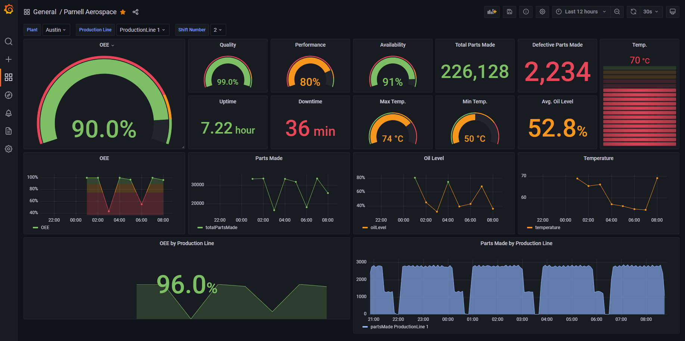

## Contents ##

1. [What is OEE?](https://github.com/iot-for-all/iiot-oee#what-is-oee)
2. [Architecture](https://github.com/iot-for-all/iiot-oee#scenario)
3. [Setting up ADX](https://github.com/iot-for-all/iiot-oee#setting-up-adx)
4. [Setting up IoT Central Application](https://github.com/iot-for-all/iiot-oee#setting-up-iot-central-application)
5. [Creating ADX Dashboard](https://github.com/iot-for-all/iiot-oee#creating-adx-dashboard)
6. [Creating Grafana Dashboard](https://github.com/iot-for-all/iiot-oee#creating-grafana-dashboard)
7. [Simulator](https://github.com/iot-for-all/iiot-oee#simulator)


## What is OEE? ##
Overall Equipment Effectiveness (OEE) is a measure of how well a manufacturing operation is utilized (facilities, time and material) compared to its full potential, during the periods when it is scheduled to run. [References](https://en.wikipedia.org/wiki/Overall_equipment_effectiveness). OEE is the industry standard for measuring manufacturing productivity. OEE is calculated using 3 atttrbiutes
1. **Availability:** accounts for planned and unplanned stoppages, percentage of scheduled time that the operation is/was available to operate
2. **Performance:** measure of speed at which the work happens, percentage of its designed speed
3. **Quality:** percentage of good units produced compared to the total units planned/produced

## Scenario ##
Parnell Aerospace a fictitious company has launched a Factory of the Future manufacturing initiative to streamline operations and increase production capacity at its plants and production lines. The employees use IoT Central app to assess each shift in the plant based on the signals received from the factory equipment to calculate shift effectiveness and communicate with equipment operators and then adjust the factory equipment accordingly. 


Watch a 5 minute overview of the experience

[](https://youtu.be/VGrARGdHlyo)

## Architecture ##


The above picture shows the architecture of this OEE Application. Devices send telemetry messages to IoT Central application. This data is transformed and exported to Azure Data Explorer using the Continuous Data Export (CDE) in the IoT Central application. Dashboard over OEE database is built using KQL queries on the ADX database. 

There is no need for an external application or compute for "cooking the data". It is done in IoT Central at no extra charge.

## Setting up ADX ##
1. Create an Azure Data Explorer cluster.
2. Create a new database in this cluster.
3. Create a `boltmaker` table in this database. Schema can be found in the [boltmaker](setup/ADXDatabase.kql) file.

## Setting up IoT Central Application ##
1. Create an IoT Central application.
2. Import the [Boltmaker](setup/BoltMaker.json) device template.
3. Set up a new Continuous Data Export of all data coming from Boltmaker devices into ADX that was created earlier. You can get use the [JQ Transform](setup/CDETransform.jq) that is used below.


More information on setting up data export to ADX can be found [here](https://docs.microsoft.com/en-us/azure/iot-central/core/howto-export-data?tabs=data-explorer%2Cjavascript%2Cservice-principal).

## Creating ADX Dashboard ##
Now that the ADX Database and the CDE exports are setup, you can setup the ADX dashbaord using the exported [dashboard](setup/ADXDashboard.json) file. Make sure that you change the datasource ID in the file to your ADX datasource. Feel free to create your own dashboard by looking at the sample queries in this file.

## Creating Grafana Dashboard ##
You can visualize the data in ADX database using Grafana dashboards. Create a new Azure Managed Grafana following instructions [here](https://docs.microsoft.com/en-us/azure/managed-grafana/quickstart-managed-grafana-portal). Create a new ADX datasource following instructions [here](https://docs.microsoft.com/en-us/azure/managed-grafana/how-to-data-source-plugins-managed-identity). Once the datasource is setup, you can setup the Grafana dashbaord using the exported [dashboard](setup/grafana-dashboard.json) file.

## Simulator ##
You can [download binaries](https://github.com/iot-for-all/iiot-oee/releases) and run them as is, skip to [running simulator](https://github.com/iot-for-all/iiot-oee#running-simulator) section below.

If you want build the binaries yourself, you need to setup the development environment as follows.
### Golang ###
Follow the instructions to [install Go](https://golang.org/doc/install). Pick the appropriate package to install the
latest 1.17.x release of Go. This will give you access to the Go toolchain and compiler.

- If you are on Windows, use the MSI to install. It will set the necessary environment variables.
- If you installed via the tarball, you will need to add a GOROOT environment variable pointing to the
  folder where you installed Go (typically /usr/local/go on linux-based systems)
- You should also check to make sure that you can access the Go compiler and tools. They are available at $GOROOT/bin
  (or $GOROOT\bin) and should be added to your path if they are not already. You can verify this by running the following:
    - Max/Linux: `which go`
    - Windows (CMD): `where go`


### Build ###
Golang produces OS specific executables. You can create a binary targeting any OS from any OS.

To build starling, you can use the makefile. Help can be displayed by running `make help`.
```
$ make help
all                            Build for all platforms
build                          Build binaries for all platforms
clean                          Clean all binaries
build-windows                  Build binary for windows
build-linux                    Build binary for linux
build-darwin                   Build binary for darwin
help                           Display available commands
```

#### Build binaries ####
Use the `make` command to build binaries for all platforms.
use the following commands for building only targeting specific platform:
1. Windows: `make windows` or `GOOS=windows GOARCH=amd64 go build -v -o bin/starling_windows_amd64.exe`
2. Linux: `make linux`
3. Raspberry Pi: `make pi`
4. macOS: `make darwin` 

```
$ make
CGO_ENABLED=0 GOOS=windows GOARCH=amd64 go build -o bin/IIoTOEE_windows_amd64.exe -v
CGO_ENABLED=0 GOOS=linux GOARCH=amd64 go build -o bin/IIoTOEE_unix_amd64 -v
CGO_ENABLED=0 GOOS=darwin GOARCH=amd64 go build -o bin/IIoTOEE_darwin_amd64 -v
```
#### Cleanup ####
To clean up all the binaries, use `make clean`

## Configure ##
Create `iiot.json` file in `$src/bin` folder i.e. where you have your exe file.
```JSON
{
    "logger": {
      "logLevel": "Debug",
      "logsDir": "./logs"
    },
    "application": {
      "provisioningUrl": "global.azure-devices-provisioning.net",
      "idScope": "YOUR_SCOPE_ID",
      "masterKey": "YOUR_APP_DEVICE_ENROLLMENT_GROUP_KEY",
      "boltMachineModelID": "dtmi:parnellAerospace:BoltMakerV1;1"
    },
    "plant": [
      {
        "name": "Everett",
        "boltMachine":{
          "count": 2,
          "format": "json"
        }
      },
      {
        "name": "Austin",
        "boltMachine":{
          "count": 1,
          "format": "json"
        }
      },
      {
        "name": "Atlanta",
        "boltMachine":{
          "count": 1,
          "format": "json"
        }
      }
    ]
  }
```

## Running simulator ##
IIoT OEE simulator has a single executable.

Platform      | Executable
--------------|----------------------------------
Windows       | `IIoTOEE_windows_amd64.exe`
macOS         | `IIoTOEE_darwin_amd64`
Linux         | `IIoTOEE_linux_amd64`

If you build binaries from source, they will be in the `bin` folder.
To start the starling simulation server, run the above executable.


## Setting up Digital Twins and 3d Scenes ##
In this part we will see how to create ADT and link it to IoT Central. Lastly we will also create 3d Scene for the factory floor.

### Export data to Event Hub ###
1. Provision a new Event Hub as per the instruction [here](https://learn.microsoft.com/en-us/azure/event-hubs/event-hubs-create).
    - Add a Send + Listen Policy and then copy the connection string for later use.
    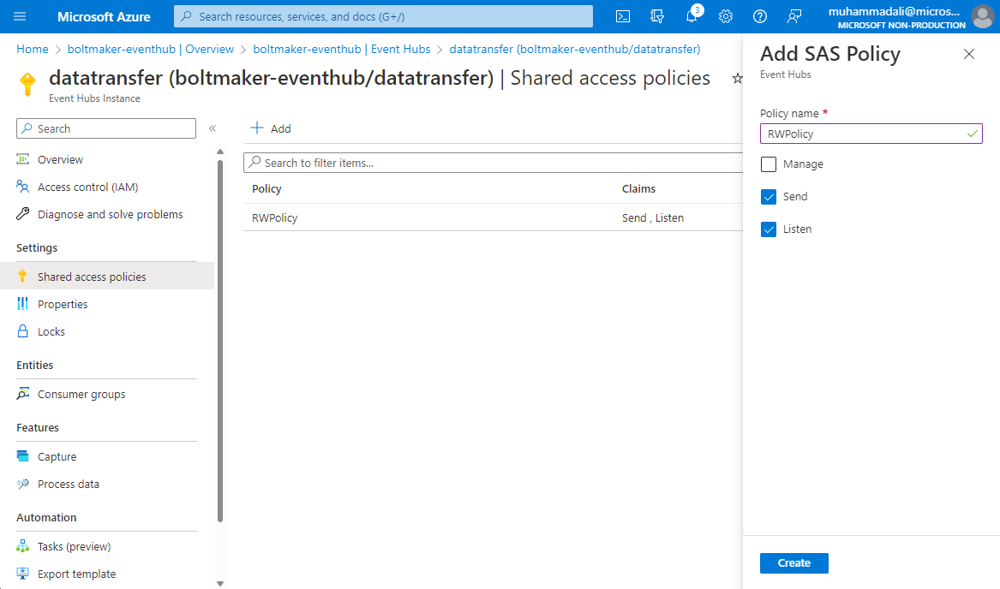
2. In IoT Central create a Data Export for all your devices to an Event Hub destination as per the instructions [here](https://docs.microsoft.com/en-us/azure/iot-central/core/howto-export-to-event-hubs?tabs=connection-string%2Cjavascript).
    - Add a new Destination (for simplicity we are using Connection String)
    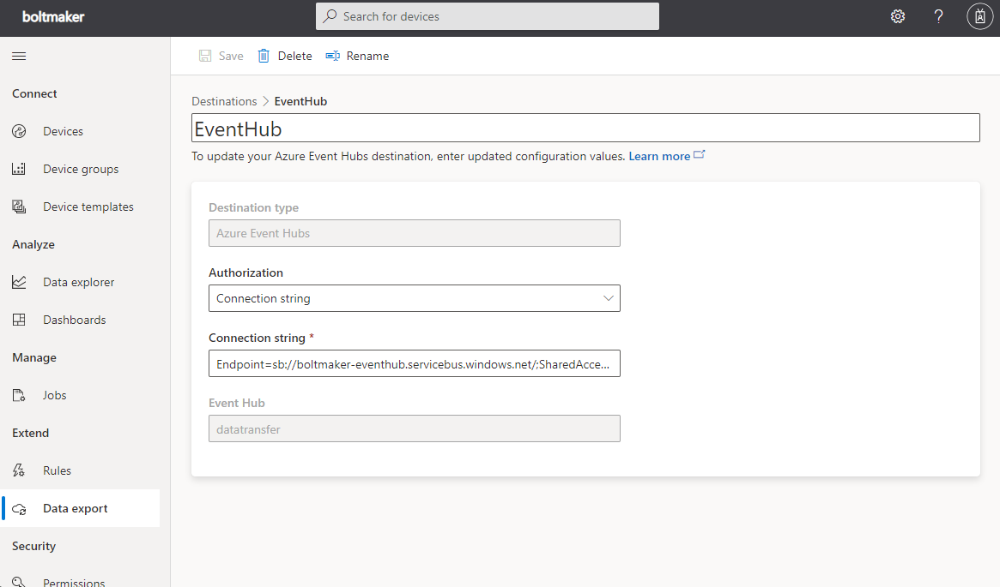
    - Configure the Data Export to export all of the Telemetry to the Event Hub destination.
    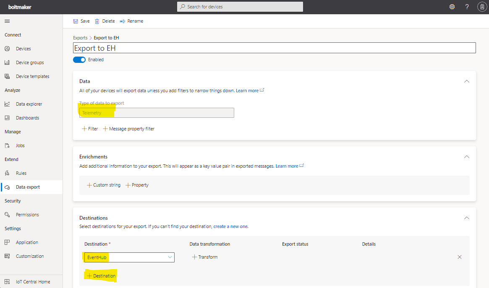

### Create ADT Service ###
1. Provision Azure Digital Twins instance as per the instruction [here](https://learn.microsoft.com/en-us/azure/digital-twins/how-to-set-up-instance-portal).
    - Once provisioned go the [Twin explorer](https://learn.microsoft.com/en-us/azure/digital-twins/how-to-use-azure-digital-twins-explorer).
2. For the device groups/models that you would like to integrate with ADT, upload their DTDL Models into the ADT. A DTDL model for Bolt Maker machine can be found [here](setup/adt/boltmaker_model.json).
  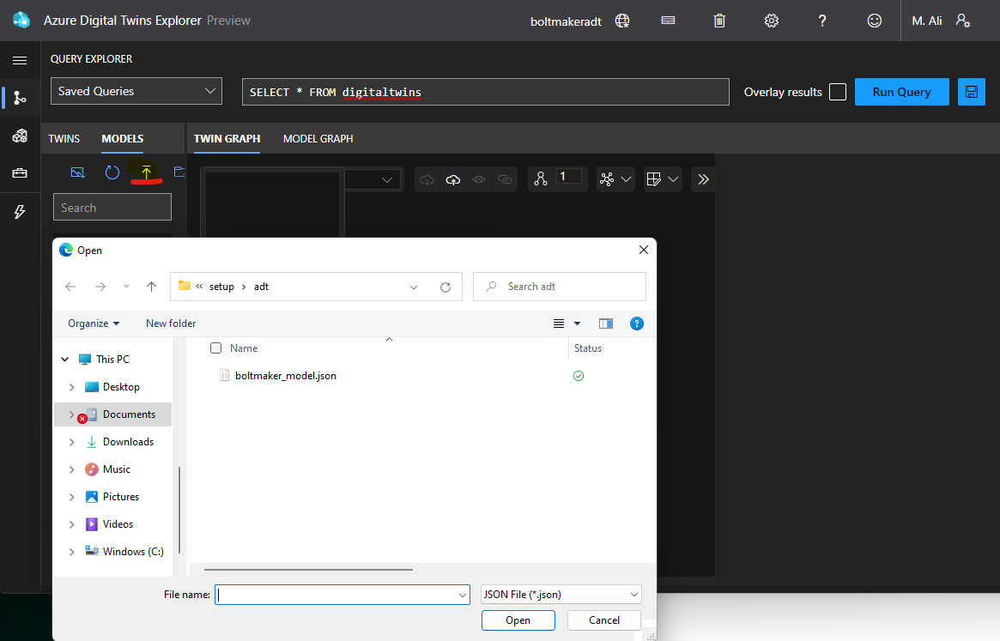
3. Create default/empty twins of the asset with a Twin Name same as the device id from IoT Central.
  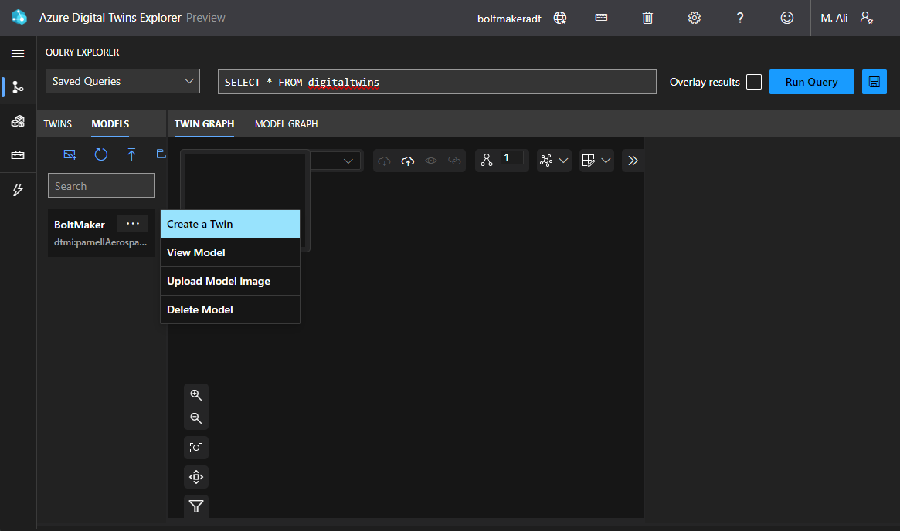
  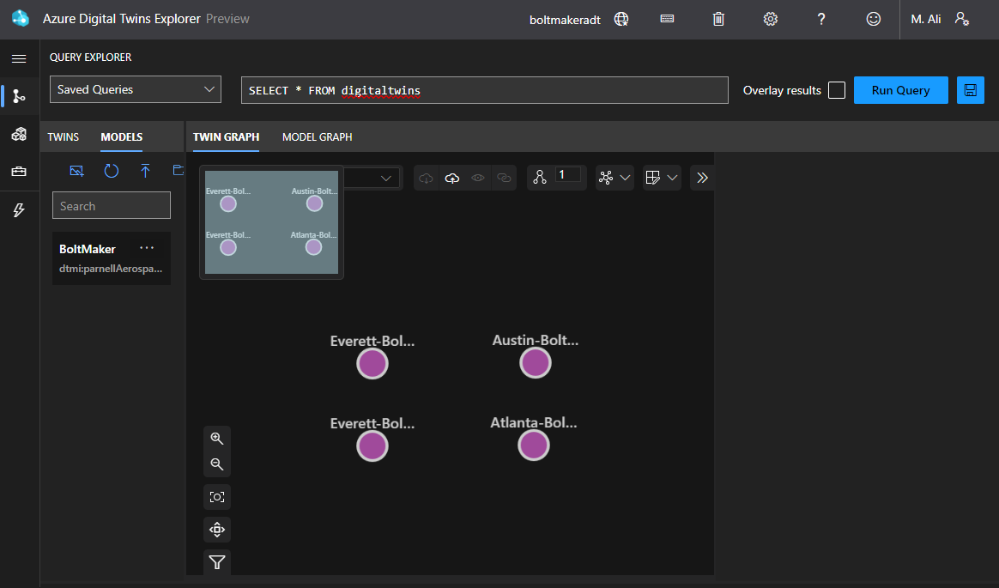

### Create Azure Function to update twins ###
Create an Azure Function with a trigger on Event Hub. This would be responsible to receive the telemetry from Event Hub and Patch it in ADT for the respective twin. 

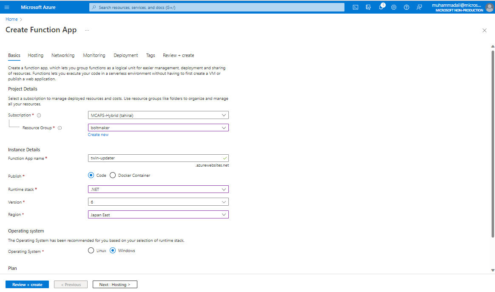

Enable managed Identity

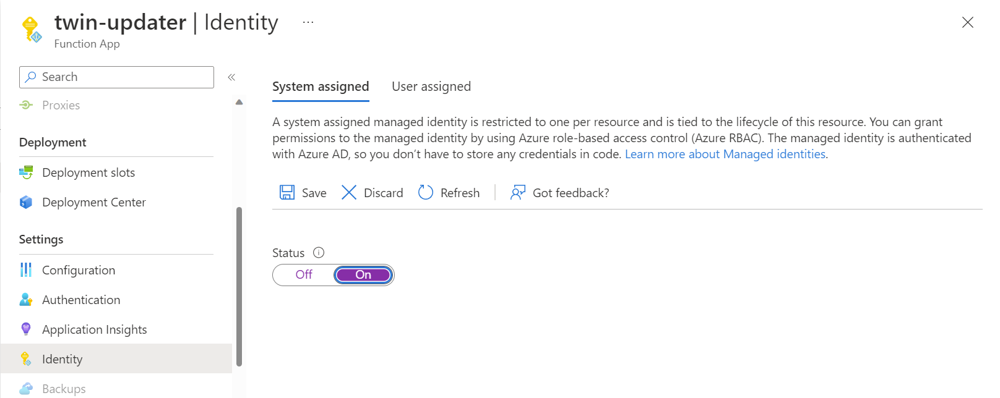

Create the Event Hub trigger

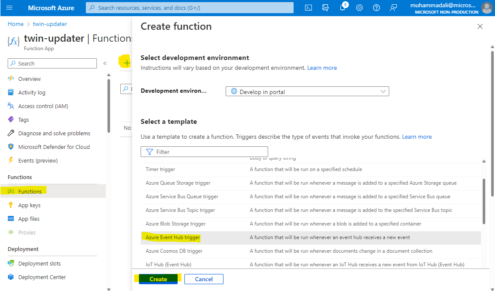

Specify the Event Hub connection string

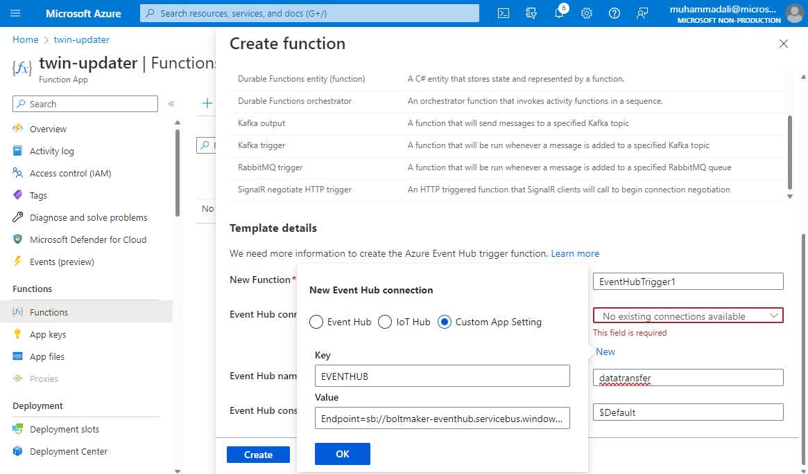

You can find the source code for this Function at [/Azure Function - Event Hub to ADT/TelemetryTrigger.cs](https://github.com/malichishti/iot-central-3dScenes/blob/main/Azure%20Function%20-%20Event%20Hub%20to%20ADT/TelemetryTrigger.cs) You can see it finds the deviceId from the message which is used to link to the corresponding twin via dtid. Next it sends a Patch to ADT for all telemetry received.

The Azure Function requires following Applications settings defined:

1. EVENTHUB - this is a connection string to the Event Hub
1. ADT_SERVICE_URL - This is the ADT Instance URL e.g. https://my-twins3.api.aue.digitaltwins.azure.net

**Please Note:** The Azure Function must have **Azure Digital Twins Data Owner** access to the ADT. You can achieve this by giving a System assigned identity to the Azure function and then adding a Role access for it on ADT.

Confirm that the data is reaching the Digital Twin by viewing a specific Twin:

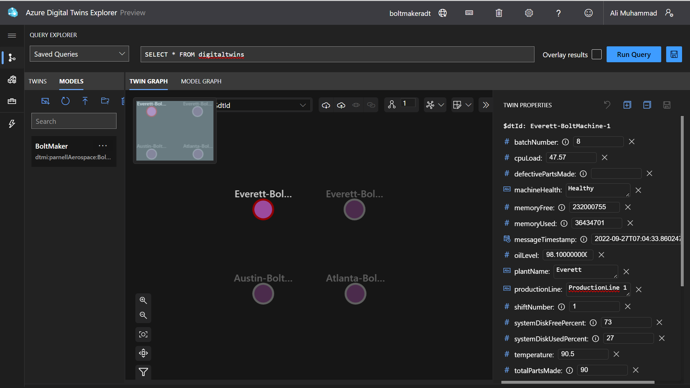

### Setup ADT 3d Scenes ###

In order to use 3d Scenes you are required to have a storage account which would be used to store Scene config and model files. Use the instructions below to create and configure the storage account.

1. Create a storage account as per instruction [here](https://learn.microsoft.com/en-us/azure/storage/common/storage-account-create?tabs=azure-portal).
1. Create a private container in the storage account. For instructions, see [Create a container](https://learn.microsoft.com/en-us/azure/storage/blobs/storage-quickstart-blobs-portal#create-a-container).
  - Take note of the URL of your storage container to use later.
1. Provide Storage Blob Data Owner or Storage Blob Data Contributor access to your user account. You can grant required roles at either the storage account level or the container level. For instructions and more information about permissions to Azure storage, see [Assign an Azure role](https://learn.microsoft.com/en-us/azure/storage/blobs/assign-azure-role-data-access?tabs=portal#assign-an-azure-role).
  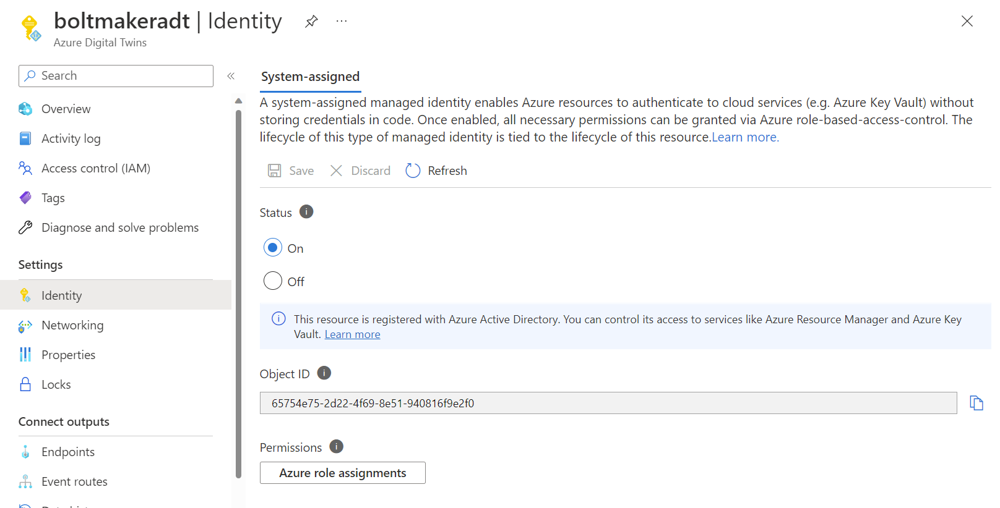
1. Configure CORS for your storage account by adding https://explorer.digitaltwins.azure.net to the allowed origins and enabling all methods. For Allowed header please specify

> Authorization,x-ms-version,x-ms-blob-type

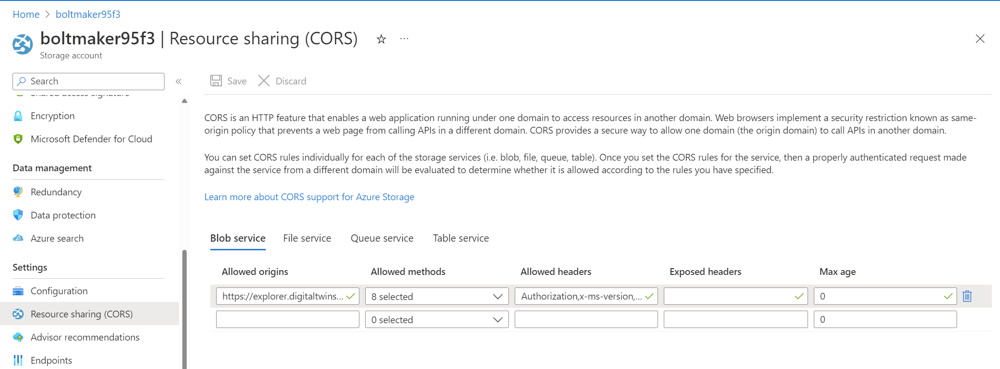

#### Create your first Scene ####

Create your first scene by using the model [here](setup/adt/RobotArms.glb)

  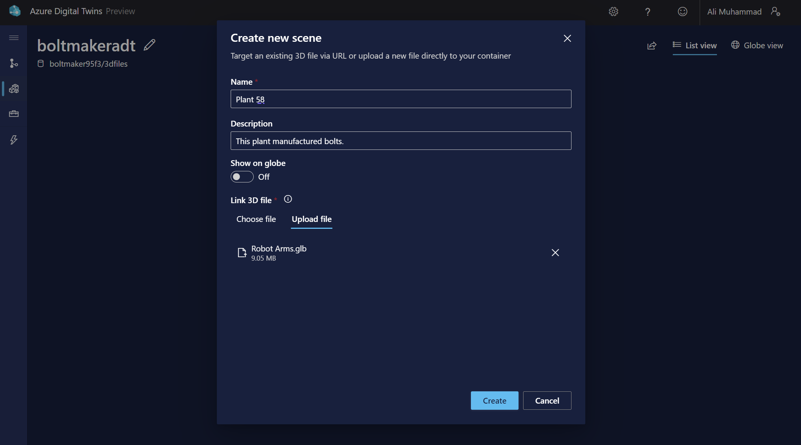

Drilldown into the scene to view the build environment. The scene would be loaded and you now have the option to select certain elements and assign behaviours to them.

1. Start by selecting the robotic arm and clicking "Create new Element"
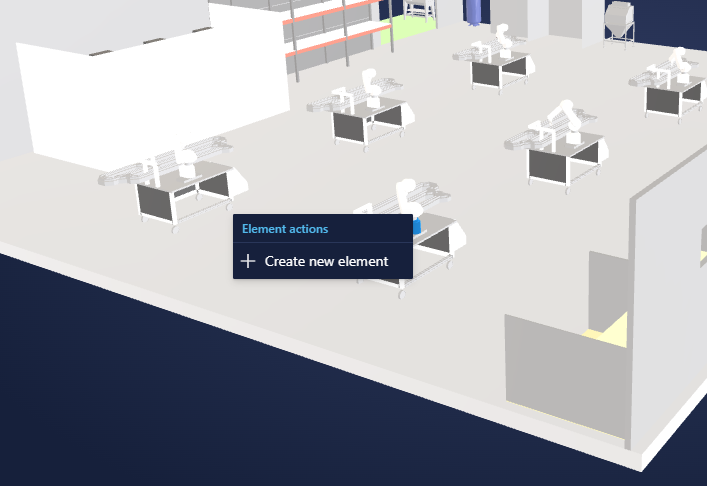
2. In the New Element blade, select the Primary Twin which represents this asset
3. In Behaviours add a new Behaviour, Behaviour allows you to design how this element should respond to the Twin changes and properties.
    - Status: You can select a property or create a rule which returns a number. Then you are allowed to define a range and assign color to each range. Whenever the value will be in one of the ranges the element would be assigned the corresponding color.
  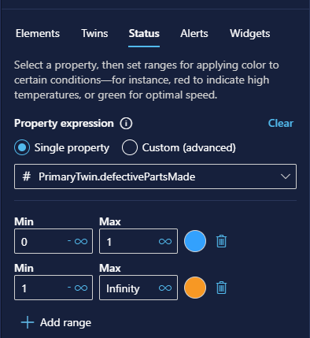
    - Alerts: You can define rules which if evaluated to true will result in an alert icon show up on the asset. You can pick the icon and its color as needed.
  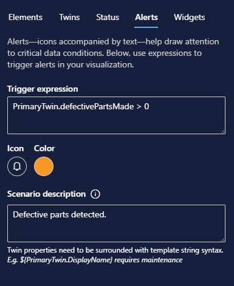
    - Widgets: This allows you to add different widgets which would show up when the user would select this element. For each widget you are able to select a property that will provide the value for the widget.
  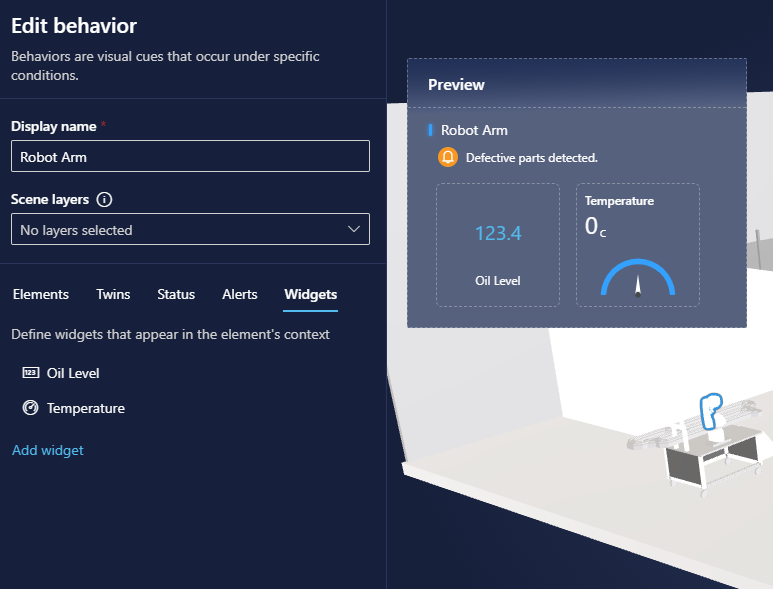

You can assign same behaviour to additional elements as well, this ensures that you do not have to create Behaviour again and again for same asset type.

#### View the 3d Scene ####

In order to view the runtime view, click on the View button on top right. You will now be able to see the elements along with the status colors or alerts. You can also select a certain element and view its widgets or other properties.

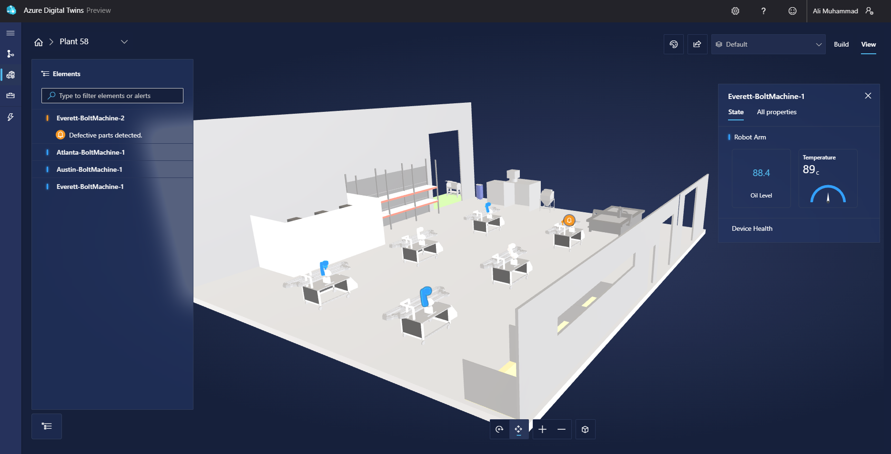


